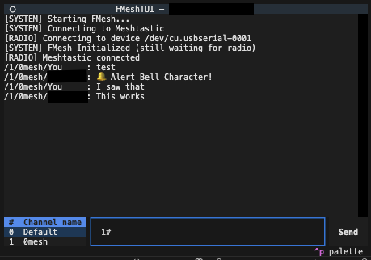

# FMesh

FMesh is a [Meshtastic](https://meshtastic.org) TUI chat interface for text-mode consoles.



## Why?

Almost any computer running Linux can now be used as an interface for Meshtastic.

A lower-power compute platform can utilize Meshtastic AND preserve battery runtime by staying in text mode.

## Quickstart

### Install

```bash
git clone https://github.com/iandennismiller/fmesh
cd fmesh
pip install .
```

### Launch

Run the following in the `fmesh` directory.

```bash
cp example-env.conf .env
fmesh-tui
```

### Send a message

Channels are numbered 0-8. To send a message to a channel, prefix the message with the number and `#`:

```txt
1# This message is being sent to channel 1.
```

Use ESC to exit.

## Configuration

To configure FMesh, create a file called `.env` based on [the example](docs/example-env.conf).

```ini
# linux
FMESH_DEVICE=/dev/ttyUSB0

# macos
# FMESH_DEVICE=/dev/cu.usbserial-0001

# channel to start on by default
FMESH_CHANNEL=0
```

The example demonstrates a Linux configuration.
To run on MacOS instead, uncomment that line.

### Configuring your LoRa device

Use https://client.meshtastic.org or another interface to actually configure your LoRa radio.

## License

[MIT License](docs/License.md)

### FMesh is a fork

FMesh is based on [TheCookingSenpai's eMesh](https://github.com/TheCookingSenpai/emesh) with patches from [svofski](https://github.com/svofski/fmesh).
